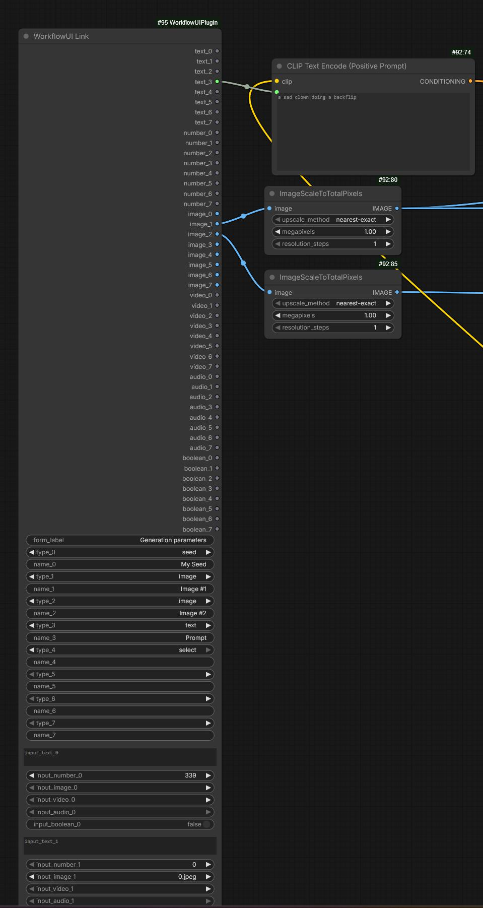

# WorkflowUI Plugin and the WorkflowUI Link Node

The **WorkflowUI Plugin** adds ComfyUI integration for WorkflowUI: HTTP APIs for media (delete, view, list, version) and a custom node, **WorkflowUI Link** (`workflow_ui_link.py`), that defines which form fields the app shows.

---

## WorkflowUI Link Node

The node is a pass-through: you set a **form label** (section title in the app) and up to 8 slots. For each slot you choose a **type** (text, number, seed, image, video, audio, boolean, select) and a **name** (label in the app; use `seed` for master seed). The node’s outputs connect into the rest of your graph. In ComfyUI you only configure types and labels; the app form is driven by that.

---

## Importing a Workflow That Contains the Node

When you import a workflow that has a WorkflowUI Link node, WorkflowUI detects it and offers **WorkflowUI Link schema**. The app form is then built from the node’s definitions only—the fields and section title you set in ComfyUI—instead of inferring inputs from the whole graph. You can still choose the generic schema (full graph analysis) if you prefer.

---

## Install

- **[ComfyUI Registry](https://registry.comfy.org/publishers/jimpi/nodes/WorkflowUIPlugin)** — install via the manager.
- **[GitHub](https://github.com/jimpi-dev/WorkflowUIPlugin)** — source and API details.

Put the plugin in `ComfyUI/custom_nodes/` and restart ComfyUI.
